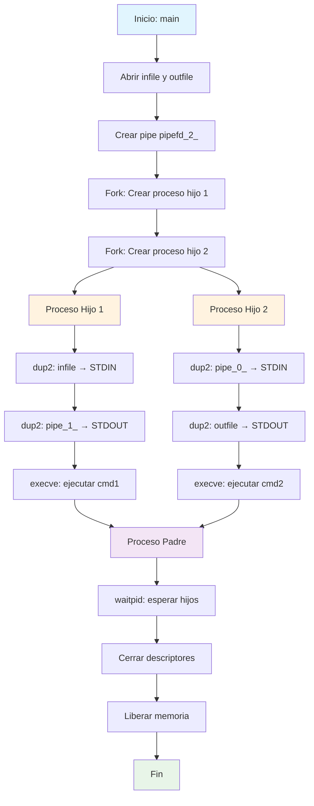

# Pipex


---

## Descripción

**Pipex** es una implementación en C que replica el comportamiento del operador pipe (`|`) de la shell de UNIX. Simula la ejecución encadenada de comandos, donde la salida del primer comando se convierte en la entrada del segundo, tal como ocurre en ejecuciones como `cat file | grep pattern`.

El proyecto demuestra competencias en gestión de procesos, comunicación inter-proceso (IPC), manipulación de descriptores de archivo y llamadas al sistema de bajo nivel.

---

## Funcionalidades

- Replicación del comportamiento del pipe de shell (`|`)
- Lectura desde archivo de entrada (`infile`)
- Escritura hacia archivo de salida (`outfile`)
- Ejecución de dos comandos encadenados
- Manejo de errores robusto con mensajes descriptivos
- Limpieza correcta de recursos y descriptores

---

## Stack Tecnológico

| Categoría | Tecnología |
|-----------|------------|
| Lenguaje | C (GCC) |
| Compilación | Makefile con flags `-Wall -Wextra -Werror` |
| Librería personalizada | [Libft](https://github.com/samuelhm/libft) (submódulo) |
| System Calls | `fork()`, `pipe()`, `dup2()`, `execve()`, `waitpid()` |
| Headers estándar | `<unistd.h>`, `<fcntl.h>`, `<sys/wait.h>`, `<stdbool.h>` |

---

## Arquitectura y Decisiones Técnicas

El proyecto implementa un modelo de **dos procesos hijo spawned desde un proceso padre**, comunicados a través de un **pipe anónimo**. El primer proceso redirige su entrada estándar al archivo de entrada (`infile`) y su salida estándar al pipe mediante `dup2()`. El segundo proceso toma la salida del pipe como su entrada y redirige su salida al archivo final (`outfile`). Esta arquitectura resuelve el reto fundamental de sincronizar la ejecución paralela de comandos UNIX respetando la semántica del operador pipe.

El uso de `execve()` con `/bin/bash -c "comando"` permite procesar comandos complejos con argumentos, delegando el parsing a la shell. La estructura `t_pipedata` encapsula todos los recursos del proyecto (descriptores de archivo, PIDs), facilitando el manejo seguro de memoria y la liberación ordenada de recursos.

---

## Flujo de Ejecución



---

## Instalación

### Requisitos

- GCC (compilador C)
- Make
- Sistema operativo UNIX/Linux o macOS

### Pasos

```bash
# Clonar el repositorio con submódulos
git clone --recursive https://github.com/samuelhm/pipex.git

# Entrar al directorio
cd pipex

# Compilar el proyecto
make
```

### Uso

```bash
# Sintaxis
./pipex infile cmd1 cmd2 outfile

# Ejemplo: equivalente a 'cat infile | grep pattern > outfile'
./pipex infile "cat" "grep pattern" outfile

# Ejemplo con más comandos
./pipex input.txt "ls -la" "wc -l" output.txt
```

---

## Limpieza

```bash
# Limpiar objetos
make clean

# Limpiar todo (incluyendo binario)
make fclean

# Recompilar completamente
make re
```

---

## Estructura del Proyecto

```
pipex/
├── inc/
│   └── pipex.h          # Header con estructuras y prototipos
├── src/
│   ├── pipex.c          # Punto de entrada y lógica principal
│   └── process.c        # Funciones de ejecución de procesos
├── lib/
│   └── libft/           # Librería personalizada (submódulo)
├── Makefile             # Reglas de compilación
└── README.md
```

---

## Contacto

| Plataforma | Enlace |
|------------|--------|
| GitHub | [github.com/samuelhm](https://github.com/samuelhm/) |
| LinkedIn | [linkedin.com/in/shurtado-m](https://www.linkedin.com/in/shurtado-m/) |

---